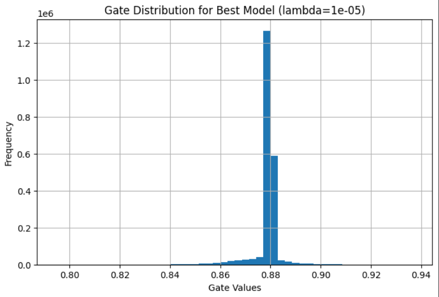
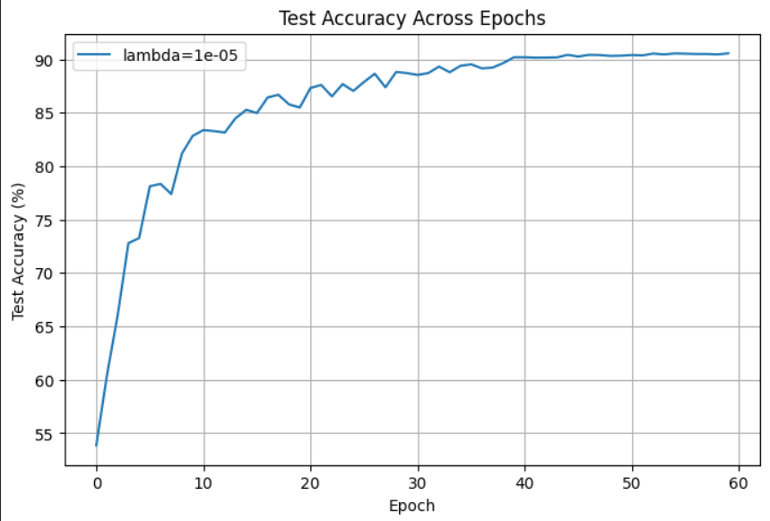
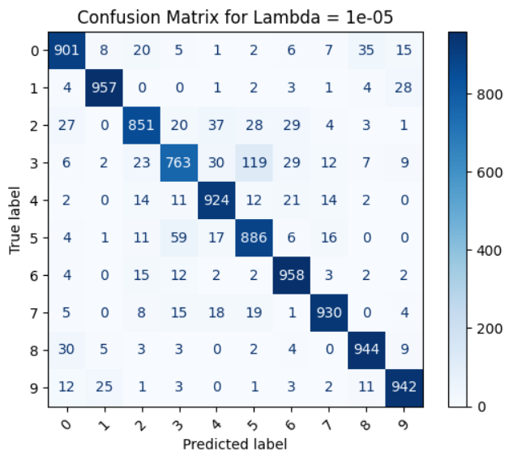
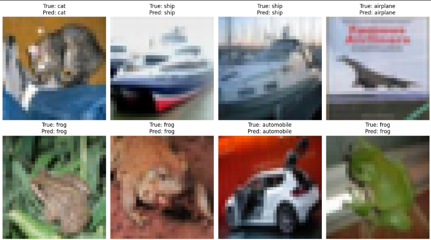

<!-- ================= HERO BANNER ================= -->
<h1 align="center"> Self-Pruning Neural Network on CIFAR-10</h1>
<h3 align="center">Learning Not Just What to Predict — But What to Keep</h3>

<p align="center">
  
  
  
  
</p>

<p align="center">
  <i>A neural network that learns both the task and its own architecture.</i>
</p>

---

##  Overview

Modern neural networks are powerful — but inefficient.

They learn:
- redundant connections  
- unnecessary parameters  
- bloated internal representations  

Traditional pipeline:
```
Train → Prune → Deploy
```

 This project flips the paradigm:

```
Train + Prune → Deploy
```

---

##  Problem Reframed

Instead of asking:

> How do we prune a trained model?

We ask:

> Can pruning be learned *during training itself*?

---

##  Core Idea

Every weight gets a **learnable gate**.

###  Forward Pass

```
gate = sigmoid(gate_score)
effective_weight = weight × gate
```

---

###  Interpretation

| Gate Value | Meaning |
|-----------|--------|
| ≈ 1 | Important |
| ≈ 0 | Pruned |

 The model learns what to **retain vs discard**

---

##  Architecture

###  Baseline (Rejected)
Fully Connected Network:
- destroys spatial structure  
- low performance  

---

### ✅ Final Model

```
[ CNN Feature Extractor ] → [ PrunableLinear Layers ]
```

---

###  Flow

```
Input Image
    ↓
Convolution Layers
    ↓
Feature Maps
    ↓
Flatten
    ↓
PrunableLinear
    ↓
PrunableLinear
    ↓
Output
```

---

###  Design Philosophy

| Component | Role |
|----------|------|
| CNN | Learn spatial features |
| Prunable Layers | Learn importance |

---

##  Training Objective

```
Total Loss = Classification Loss + λ × Sparsity Loss
```

---

###  Components

**Classification Loss**
- CrossEntropy  
- drives accuracy  

**Sparsity Loss**
```
L1(gates)
```

- pushes gates → 0  
- induces pruning  

---

##  Trade-Off

| λ | Effect |
|--|--------|
| Low | High accuracy |
| High | High sparsity |

---

##  Training Strategy

### Problem
Pruning too early → kills learning

---

### Solution

```
Early Phase → Learn Features (λ = 0)
Later Phase → Enforce Sparsity
```

---

## 📊 Final Configuration

```
Lambda (λ): 1e-05
```

---

## 📈 Results

| Metric | Value |
|------|------|
| Test Accuracy | **<YOUR VALUE>%** |
| Sparsity Level | **<YOUR VALUE>%** |
| Avg Gate Value | **<YOUR VALUE>** |

---

## 📉 Gate Distribution

<p align="center">
  
</p>

###  Insight 

- spike near 0 → pruned connections  
- spread → important features  

---

## 📊 Visuals

### Accuracy
<p align="center">
  
</p>

---

### Confusion Matrix
<p align="center">
  
</p>

---

### Predictions
<p align="center">
  
</p>

---

##  What the Model Learns

### 1️⃣ Task Knowledge
- classify images  

### 2️⃣ Structural Knowledge
- identify essential parameters  

---

##  Key Insight

> The network is not just optimizing predictions  
> It is optimizing its own structure

---

##  Requirement Mapping

| Requirement | Implementation |
|------------|---------------|
| Custom Layer | PrunableLinear |
| Gate per weight | gate_scores |
| Sigmoid gating | implemented |
| Weight × gate | implemented |
| L1 sparsity | implemented |
| Combined loss | implemented |
| Sparsity metric | implemented |
| Gate visualization | implemented |

---

##  Engineering Highlights

- Hybrid CNN + pruning architecture  
- Warmup-based sparsity scheduling  
- Gradient stabilization (clipping)  
- Balanced λ tuning  
- Real trade-off exploration  

---

##  Future Work

- Apply pruning to CNN layers  
- Structured pruning (channels/filters)  
- Export compressed model  
- Scale to larger datasets  

---

## 📁 Project Structure

```
.
├── notebook.ipynb
├── README.md
├── plots/
│   ├── gate_distribution.png
│   ├── confusion_matrix.png
│   ├── accuracy_chart.png
│   └── sample_predictions.png
├── results.csv
├── best_model.pth
```

---

## 🛠️ Setup

```
pip install torch torchvision matplotlib pandas scikit-learn
```

---

##  Run

```
python main.py
```

---

## 👨‍💻 Author

AI Engineering Case Study Submission  

Focus:
- Efficient architectures  
- Dynamic pruning  
- Model optimization  

---

##  Conclusion

> Most models learn what to predict  
>  
> This model learns what not to keep
